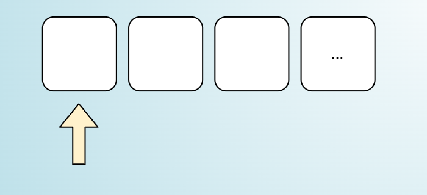
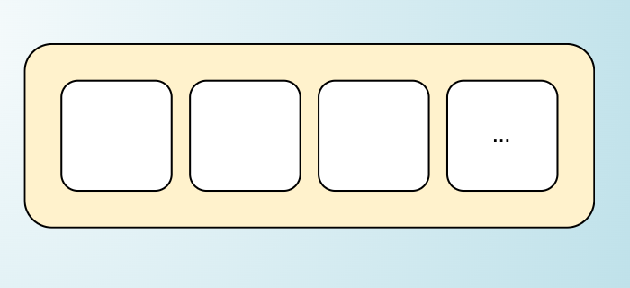

# 03 - Iterator Protocol

Before continuing let's try to distinguish between **iterator** and **iterable**. Those two concepts have very similar names and sometimes they are used interchangeably.

In JavaScript is important to understand the difference to appreciate the iteration protocols we are about to discuss.

## Iterator



An **iterator** is an object that acts like a cursor to iterate over blocks of data sequentially.

The iterator itself doesn't know much about the collection, it just knows how to move to the next element.


## Iterable



An **iterable** is an object that contains data that can be iterated over sequentially.

It's a higher level concept. You can consider an iterable as a generic collection of items. If you want to go through all the items in order, **the iterable can give you an iterator** to do that.

If you want a simple and easy definition, an iterable is a collection, an iterator is a cursor over that collection.


## Iterator protocol in JavaScript

In JavaScript, an object is considered **an iterator** if it has a `next()` method. Every time you call it, it returns an object with the keys `done` (boolean) and `value`.

What are the `done` and `value` keys for?

One way we could think about them is that they help answering the following questions:

  - Is there another value left (is it `done` or not)?
  - If there is a `value`, what it is?

Sounds familiar, right?

> **Note**: this protocol is implicit, in fact, we don't have to explicitly tell JavaScript that the object implements some sort of iterator interface. This is an application of **duck typing** ([_"If it looks like a duck, swims like a duck, and quacks like a duck, then it probably is a duck"_](https://en.wikipedia.org/wiki/Duck_test) 🦆). This means that if an iterator behaves like an iterator than it can be considered an iterator.

Ok, let's see an example. Let's say we want to implement a generic _countdown_ utility that gives us all the numbers from a positive `n` to 0:

```js
// countdown.js
function createCountdown (start) {
  let nextVal = start
  return {
    next () {
      if (nextVal < 0) {
        return { done: true }
      }
      return {
        done: false,
        value: nextVal--
      }
    }
  }
}

const countdown = createCountdown(3)
console.log(countdown.next())
console.log(countdown.next())
console.log(countdown.next())
console.log(countdown.next())
console.log(countdown.next())
```

This example will print:

```plain
{ done: false, value: 3 }
{ done: false, value: 2 }
{ done: false, value: 1 }
{ done: false, value: 0 }
{ done: true }
```

We have basically implemented a countdown from 3 to 0.

Note how `createCountdown` is just a **factory function**, it's not the iterator, but it creates one. In this implementation the iterator is just an **anonymous object**, but if we wanted we could have implemented the iterator using a **class**:

```js
// countdown-class.js
class Countdown {
  constructor (start) {
    this.nextVal = start
  }

  next () {
    if (this.nextVal < 0) {
      return { done: true }
    }
    return {
      done: false,
      value: this.nextVal--
    }
  }
}

const countdown = new Countdown(3)
console.log(countdown.next())
console.log(countdown.next())
console.log(countdown.next())
console.log(countdown.next())
console.log(countdown.next())
```

This example is perfectly equivalente to the previous one. The important part is that our iterator object exposes a `next()` method that comforms with the **iterator protocol**.


## Iterators with generators

Do you remember that we said that a generator object (an object returned by a generator function) is also an iterator? You do, right?! 😇

Ok... so that means that we could reimplement our countdown example using a generator function!

Let's see how that looks like:

```js
// countdown-generator.js
function * countdownGen (start) {
  for (let i = start; i >= 0; i--) {
    yield i
  }
}

const countdown = countdownGen(3)
console.log(countdown.next())
console.log(countdown.next())
console.log(countdown.next())
console.log(countdown.next())
console.log(countdown.next())
```

If you run this code, you'll see the same result as before.

Note how with generators we don't have to think about keeping track of the state by ourselves (we are not storing `nextVal`). We can simply use a _classic_ `for` loop and rely on the _resumability_ of generators.

Now, I hope you are appreciating all the time we spent talking about generators! Maybe you are also realising that this countdown example isn't that different from our previous `range` example! 😜


## Exercises

That's all we have to know about iterators and the iterator protocol. Let's exercise a bit 💪.

> **🏹 Exercise** ([emoji.js](/03-iterator-protocol/exercises/emoji.js))
>
> Let's implement an iterator for the emojis in a text.
>
> A skeleton of the file is available at `03-iterator-protocol/exercises/emoji.js`.
>
> You can edit the file and run an interactive test session to validate your implementation with:
>
> ```bash
> npm run ex -- 03-iterator-protocol/exercises/emoji.test.js
> ```
>
> If you really struggle with this, you can have a look at [`emoji.solution.js`](/03-iterator-protocol/exercises/emoji.solution.js) for a possible solution.


## Summary

 - An **iterator** is an object that allows us to traverse a collection
 - The **iterator protocol** specifies that an object is an iterator if it has a `next()` method that returns an object with the shape `{done, value}`. `done` (a boolean) tells us if the iteration is completed, `value` represent the value from the current iteration.
 - You can write iterators as anonymous object (e.g. returned by a factory function), using classes or using generators.


That's all for now, congratulations on finishing the third chapter! 🎉

Take a little break and get ready to move to the [Next section](/04-iterable-protocol/README.md).

---


| [⬅️ 02 - Generators](/02-generators/README.md) | [🏠](/README.md)| [04 - Iterable protocol ➡️](/04-iterable-protocol/README.md)|
|:--------------|:------:|------------------------------------------------:|
