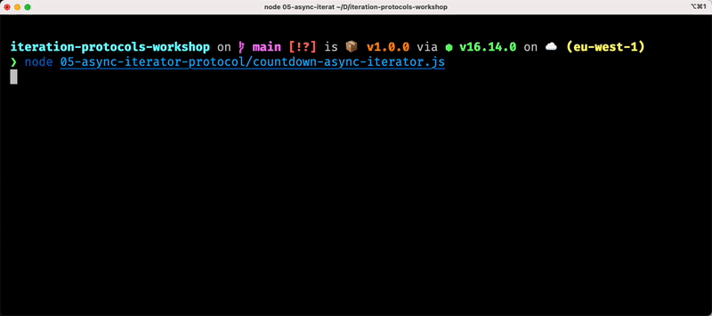

# 05 - Async Iterator Protocol

Everything we have discussed so far is **synchronous**.

This means that we can use the protocols and the techniques that we learned so far to iterate over data that is already available in memory or that it can be _produced_ synchronously.

This is great, but more often than not, JavaScript code tends to be **asynchronous**. In fact, often, our code needs to use data from files, network sockets, HTTP servers (APIs), databases, etc.

Can we apply the same principles that we learned to far in **a**synchronous situations?

The classic example is a **paginated dataset**: you need to consume a significant amount of data, so that data is exposed to you in pages. Every page contains a chunk of the whole data and you explicitly need to request the next page to keep going.

Traversing a paginated dataset generally looks like this:

  1. Get the first page
  2. Use the data from the first page
  3. Request the next page
  4. Use the data from the next page
  5. ... repeat from **3.** until there are no more pages left

Do you recall this pattern from dealing with databases and APIs?

Wouldn't it be nice if we could handle this kind of situations by doing something like this? 👇

```js
for (const currentPage of somePaginatedDataset) {
  // process data from `currentPage`
}
```

Well, yes, but this `for ... of` loop is synchronous! 🤔

We need an equivalent **a**synchronous version of this loop, something that can wait for data to be available asynchronously before triggering the next iteration.

It turns out that what we want actually exists and it's called [`for await ... of`](https://developer.mozilla.org/en-US/docs/Web/JavaScript/Reference/Statements/for-await...of):

```js
for await (const currentPage of somePaginatedDataset) {
  // process data from `currentPage`
}
```

Note the use of `await` after `for`!

We can use this kind of syntax with **async iterables**, but before we get there, we need to learn about **async iterators**!


## The async iterator protocol

An object is an **async iterator** if it has a `next()` method. Every time you call it, it returns **a promise that resolves** to an object with the keys `done` (boolean) and `value`.

This is _quite similar_ to its synchronous counterpart!

The main difference here is that the `next()` method this time returns a `Promise` object!

The promise is used to capture the asynchronicity of the iterator. The returned promise indicates that data is being fetched and that it will eventually be available. Once the promise is settled, the data is available and it is represented exactly as with synchronous iterators: an object with the shape `{ done, value }`.

So, let's see an example for an async iterator. We could stick to our countdown example, except that this time we actually want some time to pass between one item and the next are emitted:

```js
// countdown-async-iterator.js
import { setTimeout } from 'timers/promises'

function createAsyncCountdown (from, delay = 1000) {
  let nextVal = from
  return {
    async next () {
      await setTimeout(delay)
      if (nextVal < 0) {
        return { done: true }
      }

      return { done: false, value: nextVal-- }
    }
  }
}
```

A few things to note here:

  1. We are importing `setTimeout` from the core `timers/promises` module. This function is a _promisified_ version of the classic `setTimeout`. It allows us to create a promise that resolves after a given delay (specified in milliseconds).
  2. We define a factory function called `createAsyncCountdown`. This function receives the starting number and the delay between numbers (in milliseconds) as arguments.
  3. The factory function returns an anonymous object (our async iterator)
  4. The `next()` function has to return a `Promise` object. Here we are making the function `async` to do that for us! In fact, an async function always returns a promise under the hood. The promise resolves when a `return` statement is reached in the function body (and it resolves exactly to the value that is returned).
  5. Finally note how are we are _awaiting_ the promise returned by `setTimeout` to wait for a given amount of time before letting our function code continue.

I hope that all of that seems quite clear to you at this point! So now, how do we use this factory function and the async iterator that it returns?

```js
const countdown = createAsyncCountdown(3)
console.log(await countdown.next())
console.log(await countdown.next())
console.log(await countdown.next())
console.log(await countdown.next())
console.log(await countdown.next())
```

Simply, we just call the `next()` method!

But remember that this time, for every call, we get back a promise, so we need to await that promise before making another call to `next()`!

We can see what will happen in the following image:



Note how it takes roughly 1 second between a print statement and the next!

Now this doesn't look extremely useful, but imagine that you could implement an iterator that every time we call `next()` fetches data from some remote resource!


## Async iterators with generators

TODO: from here

That's all for now, congratulations on finishing the fifth chapter! 🎉

Take a little break and get ready to move to the [Next section](/06-async-iterable-protocol/README.md).

---

| [⬅️ 04 - Iterable protocol](/04-iterable-protocol/README.md) | [🏠](/README.md)| [06 - Async Iterable protocol ➡️](/06-async-iterable-protocol/README.md)|
|:--------------|:------:|------------------------------------------------:|